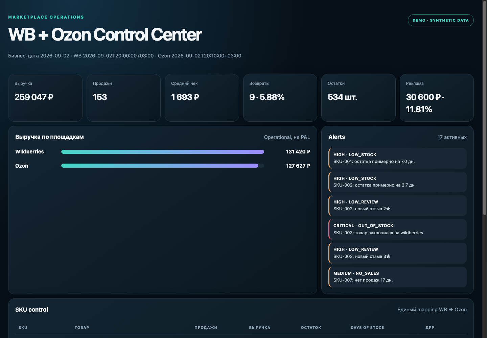

# Wildberries + Ozon Seller Operations Control Center

Portfolio-ready, credential-free demo of a seller control center for two marketplaces. It normalizes 20 source listings into 10 canonical SKU, calculates operational metrics, detects stock/reputation risks and produces a Telegram-ready daily report.



## What it demonstrates

- WB/Ozon adapter boundary and unified product mapping;
- raw → staging → canonical → marts data architecture;
- complete/partial import controls and sync watermarks;
- revenue, sales, returns, average check, stock and days-of-stock;
- low-stock, out-of-stock, no-sales and low-review alerts;
- bounded 429 retry and idempotent delivery design;
- a static dashboard and synthetic data safe for public portfolio use.

## Run locally

```bash
npm test
npm run demo
npm run build:dashboard
python3 -m http.server 8080 -d dashboard
```

Then open `http://localhost:8080`.

## Project map

- `fixtures/` — deterministic WB/Ozon demo responses;
- `src/` — validation, normalization, metrics, alerts and report formatting;
- `sql/` — isolated PostgreSQL schema and operational controls;
- `dashboard/` — read-only portfolio dashboard;
- `workflows/` — n8n Workflow SDK sources;
- `docs/` — data contract, architecture, acceptance criteria and runbook.

Start with the [case study](./docs/CASE_STUDY.md), then use the [acceptance criteria](./docs/ACCEPTANCE.md) as the demo script.

## Current scope

The repository is a complete, executable portfolio MVP. The n8n workflow is intentionally inactive and only creates a Telegram message preview; it does not call live marketplace APIs, write to a production database or send notifications. Those actions require separate read-only seller credentials, a staging database and explicit activation approval.

The demo does not claim accounting P&L and never uses third-party seller keys. Live adapters must be verified against current official marketplace documentation before activation.
