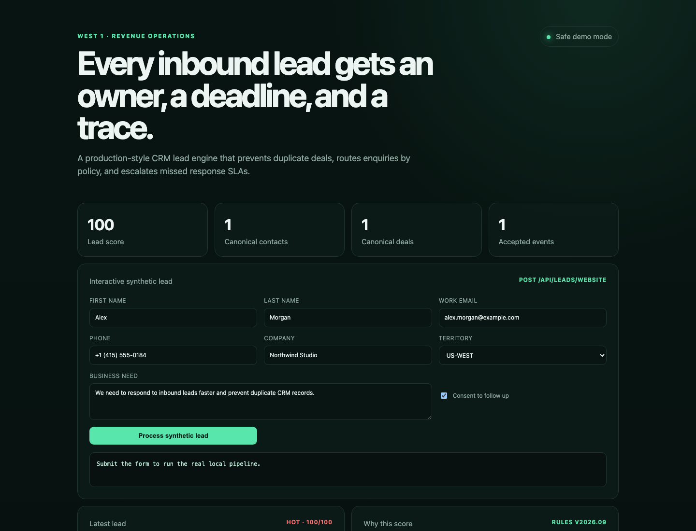

# Revenue Operations / CRM Lead Engine

Credential-free portfolio demo of a reliable inbound lead system. It captures website and Meta-compatible events, prevents duplicate contacts/deals, scores and routes leads, syncs a mock CRM, previews Slack notifications and enforces response SLA.



## What it demonstrates

- persistent-inbox architecture and event idempotency;
- email/phone normalization and identity-conflict handling;
- deterministic, explainable lead scoring with AI fallback;
- territory/service/capacity routing with round-robin and fallback owner;
- CRM and notification adapter boundaries;
- bounded `429/5xx` retry, failed-event queue and safe replay;
- reminder/escalation checkpoints with duplicate-delivery protection;
- sanitized synthetic fixtures and masked notification output.

## Run the verified demo

Node.js 20+ is the only requirement. There are no runtime dependencies.

```bash
npm test
npm run check
npm run demo
npm run serve:demo
```

Then open `http://127.0.0.1:8080`. The form calls the real local pipeline and updates the safe control totals.

## Project map

- `src/` — canonical adapters, normalization, scoring, routing, retries, SLA and demo engine;
- `test/` — automated business and failure-path coverage;
- `fixtures/` — deterministic website, Meta and owner data;
- `sql/` — isolated PostgreSQL `revops` schema and safe seed data;
- `workflows/` — n8n Workflow SDK source and exported inactive workflow;
- `dashboard/` — static case-study dashboard;
- `docs/` — specification, architecture, contracts, runbook and acceptance criteria.

Start with the [case study](docs/CASE_STUDY.md), then use the [acceptance checklist](docs/ACCEPTANCE.md) and [runbook](docs/RUNBOOK.md).

## Current scope

The executable demo is intentionally safe: it uses an in-memory store, mock CRM URLs, deterministic AI fallback and notification previews. It does not call HubSpot, Meta, Slack or a production database.

The supplied PostgreSQL model and adapter boundaries are ready for integration work, but live operation requires dedicated test credentials, creation of required HubSpot properties, deployment configuration and real end-to-end verification. The n8n workflow remains unpublished until that review is complete.
